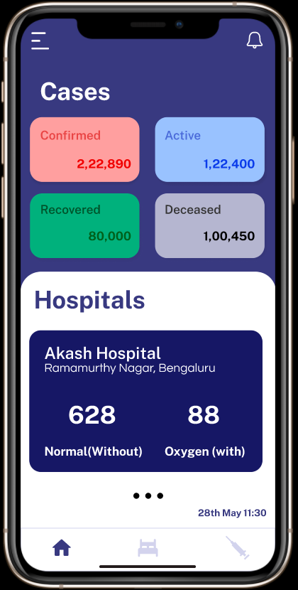
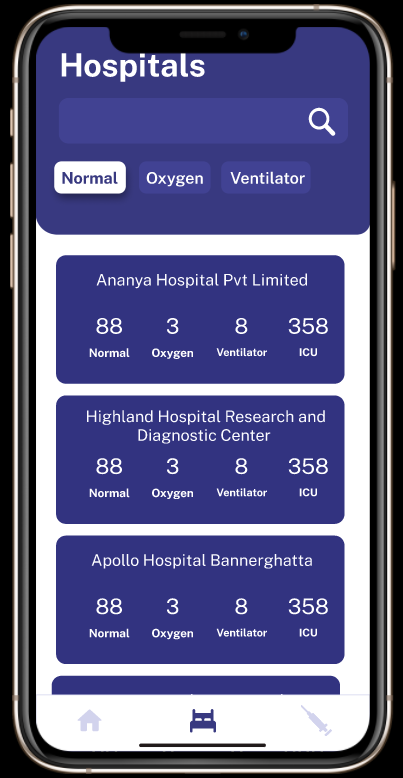
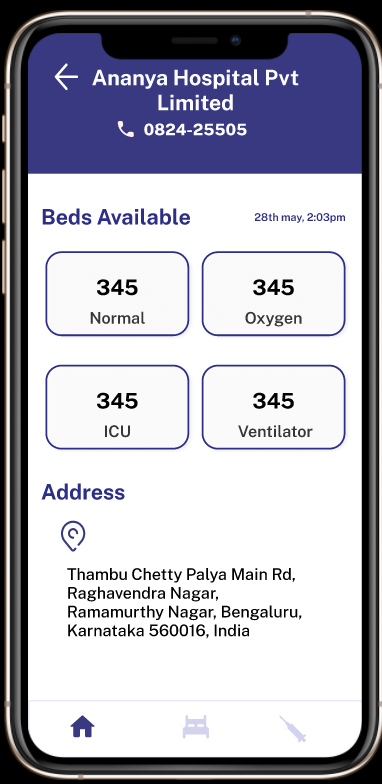
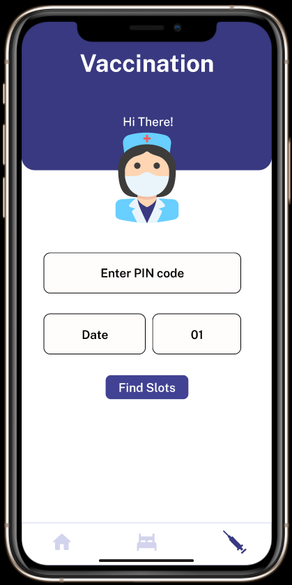

# Allsafe

### "AllSafe is all in one covid-19 Safety application at a go!”
You can  
✔ track covid-19 Karnataka cases  
✔ check for vaccination slots  
✔ view beds availability in the Bangalore region -<b> all at your fingertips!</b>

#### KEY FEATURES

### ▶ Real-Time tracking covid-19 Cases ⌛

  Just one tap and you can check the covid-19 cases of Karnataka on <b>Confirmed, Active, Recovered, and Deceased cases</b>. The app will update automatically every night and get the related information.
	
### ▶ Beds availability in Bangalore🏥
	
📌Beds availability status was last updated on 13 June 2021.

  The bed crisis was one of the most critical stages during this pandemic. And to avoid this stage we have decided to show beds availability of each hospital in the Bangalore region such as <b>normal beds without oxygen, beds with oxygen, beds with ICU and without ventilators, beds with ICU, and with ventilators</b>. In the future, we will update the status to the entire country 💪

### ▶ Check Vaccination slots ✔
		
  Getting vaccinated is our priority and to check the vaccine slots available in your region we have added this feature in our app. Just enter your Pincode, date, and month and there you go all the vaccine sots available in your region will be displayed in the app.

### ▶ User-Friendly interface 📱
	
We have designed our app in such a way that anyone can use it with ease. Cases updation time and date along with the hospital updation date has been provided on each page of the app so that you don’t need to find it 😉

## ${Developer Space}

This app is entirely built on flutter with ♥ from India and the data which are displayed in the app are from these specific websites:

### Links & Credits   
Karnataka cases - https://www.covid19india.org/  
Beds Availability - https://covidbengaluru.com/  
Vaccination Slots - https://www.cowin.gov.in/  

### API 
  + https://data.covid19india.org/v4/min/data.min.json
  + https://apisetu.gov.in/public/api/cowin

## User Interface 🍇

 &nbsp;  &nbsp;  &nbsp; 

For help getting started with Flutter, view our
[online documentation](https://flutter.dev/docs), which offers tutorials,
samples, guidance on mobile development, and a full API reference.
